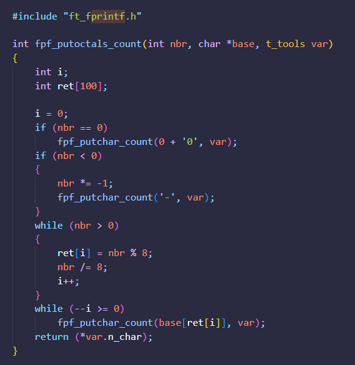

# libft

Libft is the first project of the 42 school cursus.

The goal of this project: let us recreate a basic library of functions for the C language projects.

As we progress in our cursus we update our Libft by adapting existing functions according to our needs and by adding to it other functions that which will turn out useful for the various projects we work on.